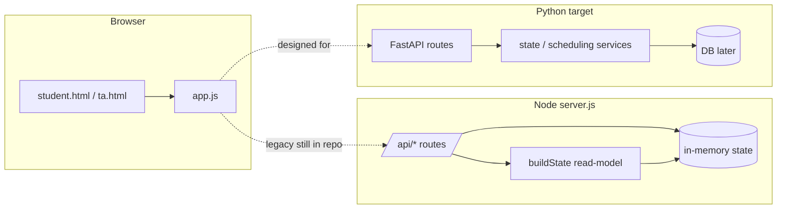

# StudyLine — Architecture & Migration Notes

A reference for understanding the current frontend/backend and what the `buildState` migration comment in `server.js` means when rewriting to Python.

---

## What “dedicated read-model / state service” means

In `server.js`, **`buildState` does not change data**. It **reads** the in-memory `state` object (availability, queue, who’s being helped, etc.) and **assembles one JSON blob** shaped exactly for the UI: slot list with wait/crowd, live stats, your place in line, staff queue, sessions, forecast.

```javascript
// server.js — concept only
function buildState(studentId, requestedSlotId) {
  const selectedSlotId = getSelectedSlotId(studentId, requestedSlotId);
  const waiting = state.queue.filter(
    (entry) => entry.status === "waiting" && entry.slotId === selectedSlotId
  );
  // ... computes waits, positions, staff view ...
  return {
    slots: ...,
    selectedSlotId,
    live: { ... },
    queue: { ... },
    staff: { ... },
    sessions: ...,
    forecast,
  };
}
```

### Read-model

From CQRS-style thinking, a **read-model** is a **view optimized for reading/display**, built from underlying facts (queue rows, slots, “current student” per slot). It is separate from **commands** that change things (join queue, call next, add availability).

### Dedicated state service

Do not leave this logic inside route handlers or mixed with writes. Put it in something like `backend/app/services/state.py` (or split helpers: `queue_read_model.py`, `slot_overview.py`) that:

- Takes **inputs** (DB/repo data + `student_id` / `slot_id` / tokens)
- Runs **pure projection** (`estimate_wait`, `crowd_level`, position, staff list)
- Returns **DTOs** for API responses

The Python migration has started in `backend/app/services/scheduling.py` (`estimate_wait`, `crowd_level`, etc.). `build_state` is stubbed at the bottom of that file and should be completed or split into focused modules.

### Important nuance: monolithic vs split API

The **current** `app.js` no longer calls one giant `GET /api/state`. It was refactored to **many smaller GETs** and builds page state on the client:

| Old (Node `server.js`) | New (frontend expects) |
|------------------------|-------------------------|
| `GET /api/state?studentId=&slotId=` | `GET /api/slots` |
| | `GET /api/slots/{id}/overview` |
| | `GET /api/queue/me?slot_id=` |
| | `GET /api/forecast?slot_id=` |
| | `GET /api/student/sessions` |
| | `GET /api/staff/queue?slot_id=` |
| | `GET /api/staff/queue/{entryId}` |

You are not necessarily shipping one Python function named `build_state()` that returns everything. You **are** porting the **same projection rules** into a read-side service, then exposing them through those focused endpoints (or one internal service used by several routes).

### Writes vs reads in Node today

- **Writes:** POST queue, POST availability, POST `call-next`, etc. → mutate `state`, then call `buildState()` and return `{ ..., state: buildState(...) }`.
- **Reads:** `GET /api/state` → only `buildState()`.

In Python, keep that separation: command handlers update the DB; the read service builds responses (or the client refetches read endpoints after mutations, as `app.js` already does).

---

## What StudyLine is

**StudyLine** is a demo/MVP for **virtual office-hours queues**:

- Students pick a time slot, join a line remotely, and see estimated wait.
- TAs manage who’s next and mark visits done.
- Optional **Gemini** (or heuristics) estimates how long each question might take, which feeds wait math.

---

## Original backend (`server.js`)

Single Node process (default port **5174** via `npm start`):

1. **Serves static files** — `index.html`, `student.html`, `ta.html`, `styles.css`, `app.js`.
2. **Holds all data in memory** — `state` with `availability`, `queue`, `currentBySlot`, `servedBySlot`, plus demo seed data.
3. **REST API** under `/api/`:

| Endpoint | Role |
|----------|------|
| `GET /api/state` | Full dashboard snapshot (`buildState`) |
| `POST /api/availability` | TA adds 30‑min blocks from a time range |
| `DELETE /api/availability/:id` | Remove slot + related queue state |
| `POST /api/queue` | Student joins (runs AI triage) |
| `DELETE /api/queue/:id` | Leave queue |
| `POST /api/staff/call-next` | Call next student for a slot |
| `POST /api/staff/serve-current` | Mark current done |
| `POST /api/simulate-crowd` | Demo: random queue churn |

There is no database and no real auth in the Node MVP (student identity was a UUID in query/localStorage; the new frontend uses **tokens** instead).

Core domain helpers live in the same file: slot IDs, 30‑min slot expansion, wait estimation, `buildState`, AI analysis (`analyzeQuestion` / Gemini / heuristics).

See the **MIGRATION INVENTORY** comment block at the top of `server.js` for which functions to keep, delete, or treat as demo-only.

---

## Frontend (vanilla HTML + `app.js`)

Three pages, one shared script:

| File | Purpose |
|------|---------|
| `index.html` | Pick Student vs TA |
| `student.html` (`data-page="student"`) | Join line, crowd, recommendations, forecast, “your turn” UI |
| `ta.html` (`data-page="ta"`) | Add/remove availability, call next, mark served, queue list with AI summaries |

### `app.js` flow

1. On load, **`loadState()`** parallel-fetches several APIs and merges into `appState`.
2. **Renders** DOM sections (`renderLiveData`, `renderStaffDashboard`, etc.).
3. **Mutations** (join, leave, call next) POST/DELETE, then **`refreshAfterMutation()`** refetches.

The file header documents the **expected FastAPI endpoints**. If the backend is not running, the UI shows “Backend is not running.”

### Identity & storage

`localStorage` keys:

- `oh_queue_token` — queue membership
- `oh_session_token` — student session across slots
- `oh_selected_slot_id` — currently selected office-hour slot

Requests send `X-Queue-Token` and `X-Session-Token` headers. The legacy `oh_student_id` key is removed on load.

### Staff page optimization

1. Light list from `GET /api/staff/queue?slot_id=`
2. Per-entry `GET /api/staff/queue/{entryId}` for full message/AI payloads

This avoids embedding large queue details on every poll.

### Expected API endpoints (from `app.js`)

```
GET  /api/slots
GET  /api/slots/{slotId}/overview
GET  /api/forecast?slot_id={slotId}
GET  /api/queue/me?slot_id={slotId}
GET  /api/student/sessions
GET  /api/staff/queue?slot_id={slotId}
GET  /api/staff/queue/{entryId}
POST /api/queue
DELETE /api/queue/me?slot_id={slotId}
POST /api/staff/call-next?slot_id={slotId}
POST /api/staff/serve-current?slot_id={slotId}
POST /api/simulate-crowd?slot_id={slotId}
POST /api/availability
DELETE /api/availability/{slotId}
```

---

## Python backend (in progress)

| Path | Role |
|------|------|
| `backend/app/main.py` | FastAPI entrypoint; routes should stay thin |
| `backend/app/services/scheduling.py` | Slot IDs, slot creation, wait/crowd helpers; `build_state` incomplete |

Run the legacy stack: `npm start` (Node + static files).

Run the new API: FastAPI (e.g. `uvicorn` on a separate port). The frontend is written for the new API shape, not necessarily the old monolithic `/api/state`.

---

## Mental model



---

## Practical takeaway for the Python rewrite

1. **`buildState` logic = read-model service** — aggregate and compute for display; no side effects.
2. **Expose it** via an internal module used by many routes (matching `app.js`), or temporarily one `GET /api/state` that delegates to that service for parity with Node.
3. **Do not put** wait/position/crowd math inside POST handlers; call the read service after writes, or let the client refetch read endpoints (as `app.js` already does).
4. **`scheduling.py`** is the right home for slot/wait math; a sibling module (e.g. `state.py`) fits slot overview, queue status, and staff queue projections.

### Suggested module mapping

| `server.js` area | Python direction |
|------------------|------------------|
| `slotIdFor`, `createSlot`, `createThirtyMinuteSlots` | `scheduling.py` (started) |
| `estimateWait`, `crowdForWait`, `getEntryHelpMinutes` | `scheduling.py` (started) |
| `getSelectedSlotId`, `buildState` | `state.py` or `read_model.py` |
| `analyzeQuestion*` | `ai.py` or `services/triage.py` |
| Route handlers | `main.py` + routers; thin handlers only |
| `loadEnvFile`, `sendJson`, `serveStatic` | FastAPI settings, responses, static mount or separate frontend host |

---

## Key files quick reference

```
-StudyLine/
├── index.html          # Role picker
├── student.html        # Student UI
├── ta.html             # TA UI
├── app.js              # Frontend logic & API client
├── styles.css
├── server.js           # Legacy Node backend + migration notes
├── package.json        # npm start -> node server.js
└── backend/
    └── app/
        ├── main.py
        └── services/
            └── scheduling.py
```
